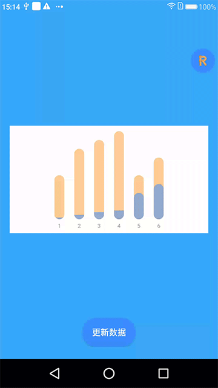

[](https://github.com/yinhaide/Rocket-master/wiki)
[](https://github.com/yinhaide/Rocket-master/wiki)
[](https://www.apache.org/licenses/LICENSE-2.0)

# HDCylinder
一个非常轻量级别的圆角双重叠圆柱，支持渐动画以及各种自定义属性



## 特性
+ **支持动画过度**

+ **圆滑的圆角显示**

+ **支持选中变大、变色、气泡提示**

+ **支持各种自定义属性**

## 如何快速集成

### 导入方式
在工程级别的**build.gradle**添加
```
allprojects {
    repositories {
        ...
        maven { url 'https://jitpack.io' }
    }
}
```
在应用级别的**build.gradle**添加
```
api 'com.github.yinhaide:HDCylinder:0.0.1'
```

## 可设置属性
```
//颜色属性
private int behindColor = Color.parseColor("#8AFFA239");//背后柱形的颜色
private int behindSelectColor = Color.parseColor("#FFFFA239");//背后柱形的颜色
private int frontColor = Color.parseColor("#8A398EFF");//前面柱形的颜色
private int frontSelectColor = Color.parseColor("#FF398EFF");//前面柱形的颜色
//柱形属性
private float barWidthRatio = 0.05f;//正常柱形宽度百分比
private float selectBarWidthRatio = 0.07f;//选中的柱形宽度百分比
private float distanceRatio = 0.05f;//柱形间距宽度百分比
private float marginTextRatio = 0.03f;//柱形距离横坐标点娿距离百分比
//画板四周边距
private float marginLeftRatio = 0.05f;//画板左边距百分比
private float marginRightRatio = 0.05f;//画板右边距百分比
private float marginTopRatio = 0.05f;//画板上边距百分比
private float marginBottomRatio = 0.05f;//画板下边距百分比
//文字属性
private float textRatio = 0.05f;//文字的大小百分比
//气泡的属性
private float bubbleHeightRatio = 0.2f;//泡泡的高度百分比
private float bubbleWidthRatio = 0.2f;//泡泡的长度百分比
private float triangleRatio = 0.02f;//尖部三角形边长百分比
//动画
private int animationTime = 1000;//动画持续时间
```

## 范例
> 注意点:如果要设置渐变色的画注意其实颜色与结束颜色要保持一致
```
[XML]
    <com.yhd.cylinder.CylinderView
        android:background="@color/colorWhite"
        android:id="@+id/bcv"
        android:layout_marginStart="16dp"
        android:layout_marginEnd="16dp"
        android:layout_centerInParent="true"
        android:layout_width="match_parent"
        android:layout_height="wrap_content"
        app:cy_barWidthRatio="0.05"
        app:cy_selectBarWidthRatio="0.07"/>

[JAVA] 
    /**
     * 柱形高度分布情况,是一个String[]类表,规则如下
     * float[0]:前面柱形高度百分比(0-1f)
     * float[1]:后面柱形高度百分比(0-1f)
     */
    List<float[]> heightArray = new ArrayList<>();
    //x坐标轴的文字描述列表
    List<String> xAxisArray = new ArrayList<>();
    //点击选中之后显示的文字.需要换行的用'/'分开
    List<String> tipsArray = new ArrayList<>();
    //设置默认值

    heightArray.add(new float[]{0.02f, 0.5f});
    heightArray.add(new float[]{0.05f, 0.8f});
    heightArray.add(new float[]{0.08f, 0.9f});
    heightArray.add(new float[]{0.1f, 1f});
    heightArray.add(new float[]{0.3f, 0.5f});
    heightArray.add(new float[]{0.4f, 0.7f});

    xAxisArray.add("1");
    xAxisArray.add("2");
    xAxisArray.add("3");
    xAxisArray.add("4");
    xAxisArray.add("5");
    xAxisArray.add("6");

    tipsArray.add("Deephhhhdd 20 min/Light 18 min");
    tipsArray.add("Deep 10 min/Light 15 min");
    tipsArray.add("Deep 30 min/Light 28 min");
    tipsArray.add("Deep 40 min/Light 16 min");
    tipsArray.add("Deep/Light");
    tipsArray.add("Deep 50 min/Light 18 min");

    cylinderView.setdataSource(heightArray, xAxisArray, tipsArray);
```

## 分享设计思路
> 绘制圆柱的难点在于当高度在一个宽度半径范围之内，直接调用drawRoundRect是不会得到预期值的，需要分别处理
+ 第一步：圆柱高度小于半径高度绘制扇形
+ 第二步：圆柱高度大于一个半径下两个半径绘制半圆加长方形
+ 第三部：圆柱高度大于直径绘制圆柱形

## 写在最后... 
> 都看到这里了，如果觉得写的可以或者对你有帮助的话，给个星星点下Star呗~

这个控件内部采用一个Fragment框架，如果有兴趣的话可以去了解一下
+ https://github.com/yinhaide/Rocket-master

## LICENSE
````
Copyright 2019 haide.yin(123302687@qq.com)

Licensed under the Apache License, Version 2.0 (the "License");
you may not use this file except in compliance with the License.
You may obtain a copy of the License at

    http://www.apache.org/licenses/LICENSE-2.0

Unless required by applicable law or agreed to in writing, software
distributed under the License is distributed on an "AS IS" BASIS,
WITHOUT WARRANTIES OR CONDITIONS OF ANY KIND, either express or implied.
See the License for the specific language governing permissions and
limitations under the License.
````